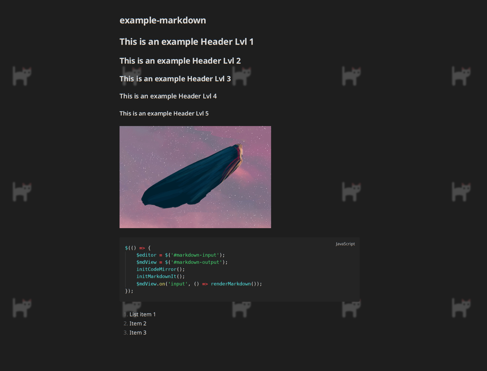
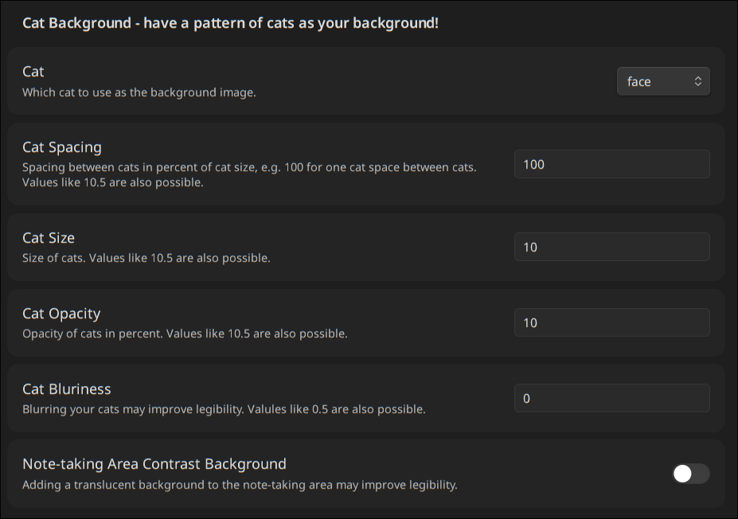
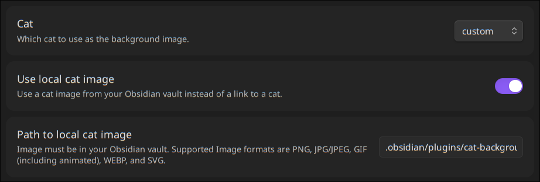
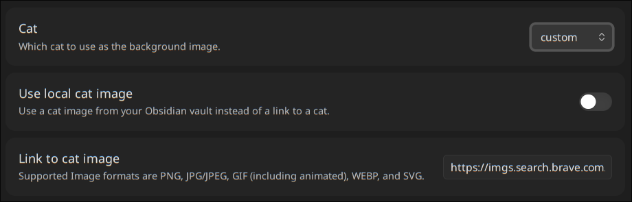

# Cat Background for [Obsidian](https://obsidian.md/)

### Have some cats on your Obsidian (editor view) background!

You can choose between a few shipped cats or even a custom cat image of your choice (local or online).

> Using the "custom" cat option, you could even choose an image without a cat 🤯 (but that's not intended)

# Installation

This plugin is not (yet) available for installation as a community plugin directly in Obsidian. You will have to:

1. Grab the latest release `.zip` from [here](https://github.com/julius-boettger/obsidian-cat-background/releases)
2. In your file explorer, navigate to your Obsidian vault, then to the `.obsidian` directory, then to the `plugins` directory
    - If any of these directories don't exist yet, create them first
3. Extract the downloaded `.zip` to the `plugins` directory
    - `your-vault/.obsidian/plugins` should now contain a `cat-background` directory, containing some files
4. In Obsidian, enable and configure the plugin

# Examples

# Settings

### Custom cat settings

##### Using local cat

##### Using link to cat

# Credit

This plugin is heavily based on the [Background Image Plugin](https://github.com/shmolf/obsidian-editor-background), specifically on [this commit of @rfm0905's fork](https://github.com/rfm0905/obsidian-editor-background/tree/d4b01f60a549cf1ae884a2a0120c99a72bb6ceae).
